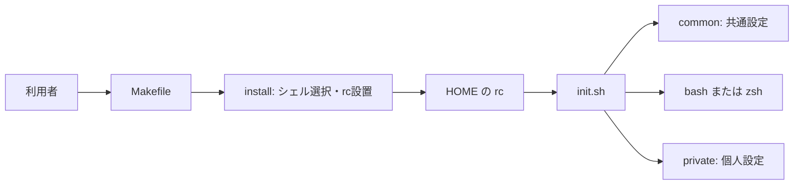

# shelld の概要

shelld は、個人の端末で使う Bash / Zsh の設定を管理するリポジトリ。利用者自身がログインシェルの選択、rc の適用、設定の編集を行う。現在の導入手順は Arch Linux 向けで、Mac 対応は未実装。

設定の実体はリポジトリにあり、HOME の rc が読み込む。導入・復旧の入口は [README](../../README.md)、実装の入口は [init.sh](../../init.sh) と [Makefile](../../Makefile)。外部コマンドとの関係は [技術構成](06_TECH_STACK.md) を参照。

## 読む順序

| 文書 | 担当する情報 |
| --- | --- |
| [01 目的と範囲](01_GOALS_AND_SCOPE.md) | 対応環境・責任の境界 |
| [02 要件](02_REQUIREMENTS.md) | 安定した挙動と確認の限界 |
| [03 ドメインモデル](03_DOMAIN_MODEL.md) | rc・設定・バックアップの所有関係 |
| [04 アーキテクチャ](04_ARCHITECTURE.md) | 起動・適用・失敗時の流れ |
| [05 設計原則](05_DESIGN_PRINCIPLES.md) | 実装から確認できる方針 |
| [06 技術構成](06_TECH_STACK.md) | 言語・ツール・依存関係 |
| [07 開発ガイド](07_DEVELOPMENT_GUIDE.md) | 作業・検証・復旧の入口 |
| [08 意思決定](08_DECISIONS.md) | 採用済み方針と未決事項 |
| [09 用語集](09_GLOSSARY.md) | このプロジェクトでの用語 |

ChatGPT Project へ渡す場合は、この文書から 01〜09 の順に追加する。文書の作成だけではアップロードされない。Beads の DB、秘密情報、生成 hook、短期の作業記録は追加しない。進行中の課題は Beads、実行規約は [AGENTS.md](../../AGENTS.md) が正本。
