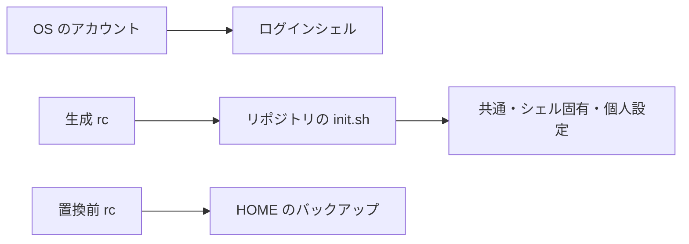

# ドメインモデル

| 概念 | 識別・所有・寿命 |
| --- | --- |
| 対象シェル | `bash` または `zsh`。導入スクリプトが受け付ける選択値 |
| ログインシェル | OS のアカウント情報。rc の設置とは独立した状態 |
| 生成 rc | HOME の `.bashrc` / `.zshrc`。リポジトリの `init.sh` を参照する入口 |
| 設定モジュール | `common/`、`bash/`、`zsh/` 以下。各 `init.sh` が配下を読み込む |
| 個人設定 | リポジトリ直下の `private/`。存在する場合は最後に読み込み、利用者が所有する |
| rc バックアップ | HOME の `.shelld-backup.XXXXXXXX/`。置換前の rc を保持し、自動削除しない |
| 作業課題 | Beads の ID で識別。要件・担当・検証・完了理由の正本 |

リポジトリを移動しても rc の参照先は自動更新されない。新しい場所から再適用する。バックアップと履歴ファイルは利用者の HOME にあり、Git で管理する設定の実体とは分かれる。

根拠: [install.sh](../../install/install.sh)、[init.sh](../../init.sh)、[ignore 規則](../../.gitignore)、[作業規約](../../AGENTS.md)。
