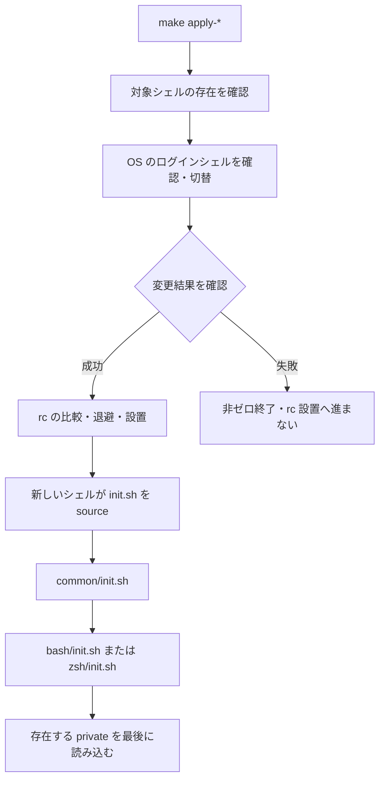

# アーキテクチャ

[Makefile](../../Makefile) が適用順序を所有し、[change-shell.sh](../../install/change-shell.sh) はアカウント変更、[install.sh](../../install/install.sh) は rc とバックアップを所有する。切替成功後の rc 設置失敗は独立して回復する。手順は [README](../../README.md) を参照。

[ローダー](../../common/load_functions.sh) は `.sh` ファイルと直下ディレクトリの `init.sh` を source する。既定では自身の `init.sh` を除外し、呼び出し側が明示的に次の階層へ進む。[起動入口](../../init.sh) は最後にロード補助関数を解除する。起動全体をロールバックする機構はない。

## 実行と信頼の境界

- source された設定は現在のユーザー権限で動き、環境変数・alias・関数を変更する。信頼できる設定だけを配置する。
- Zsh は [補完](../../zsh/completion/init.sh) を初期化し、導入済み Docker / kubectl の出力を source する。[goenv](../../common/golang/golang.sh) も存在時に初期化出力を eval する。
- [履歴](../../zsh/history/history.sh) と [Bash 履歴](../../bash/history/history.sh) は HOME にファイルを作る。起動検証でも普段の HOME を使わない。
- `sudo` を含む alias は定義時ではなく利用者が呼び出した時に作用する。

サーバーや常駐サービスを配備する構成はない。ここで述べるのはリポジトリの実装であり、端末の実際の導入状態ではない。
